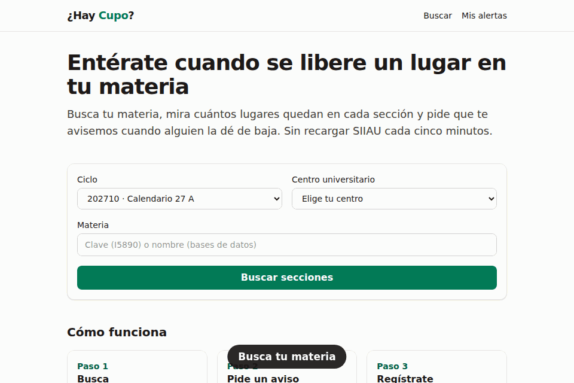
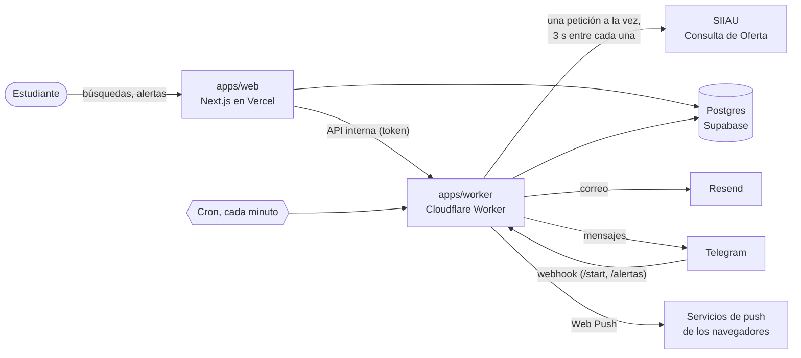

# ¿Hay Cupo?

[](https://github.com/marvin7460/SiiauAlarma/actions/workflows/ci.yml)

Entérate en cuanto se libera un lugar en una sección de la Universidad de Guadalajara, en vez de
recargar SIIAU una y otra vez durante la semana de registro.

> Proyecto independiente de un estudiante. **No está afiliado a la Universidad de Guadalajara.**
> [Read in English](README.md).



<sub>Grabado contra el SIIAU falso que usan las pruebas (`pnpm --filter @haycupo/web demo:gif`).
Las secciones y los profesores son inventados.</sub>

## El problema

En la UdeG el registro de materias se hace en SIIAU. Las secciones más buscadas se llenan en
minutos, y un lugar solo vuelve a aparecer cuando alguien da de baja la materia. La única forma
de alcanzarlo es recargar la Consulta de Oferta Académica, a mano, durante días. Eso le quita
tiempo a los estudiantes y le pone carga a SIIAU.

**¿Hay Cupo?** vigila las secciones que te interesan y te avisa, por correo, Telegram o
notificación del navegador, en cuanto una pasa de 0 a 1 o más lugares libres.

## La app

Se lanza antes del registro de 2027A (11 al 15 de enero de 2027).

<!-- TODO(Marvin): cambia la línea de arriba por la URL de producción cuando esté desplegada. -->

## Qué hace

- **Búsqueda** por ciclo, centro y materia (clave o nombre, con autocompletado). Cada sección
  muestra NRC, cupo, lugares libres, horario, edificio y aula, profesor y qué tan recientes son
  los datos.
- **Alertas** para un NRC, para _cualquier_ sección de una materia (con filtros opcionales de
  días, horario o profesor), o para cuando publiquen la oferta de una materia.
- **Tres canales:** correo (entras con un enlace, sin contraseña), un bot de Telegram y
  notificaciones del navegador (PWA instalable, también en iPhone).
- **Sin falsas alarmas ni spam:** solo cuenta el paso de 0 a más de 0; un error de SIIAU o una
  página rara nunca dispara avisos; como máximo un mensaje por alerta cada 30 minutos. Las
  alertas se apagan solas al terminar el registro.
- **Páginas públicas:** [estado del servicio](apps/web/src/app/estado/page.tsx) (¿está
  funcionando ahora?), [métricas de impacto](apps/web/src/app/impacto/page.tsx) sin cookies,
  aviso de privacidad, y "descargar mis datos" y "borrar mi cuenta" sin escribirle a nadie.

## Tecnologías

| Capa          | Elección                                                                             |
| ------------- | ------------------------------------------------------------------------------------ |
| Web           | Next.js 16 (App Router, Server Actions), React 19, Tailwind CSS 4 en Vercel          |
| Worker        | TypeScript en Cloudflare Workers (cron cada minuto); el mismo código corre en Node   |
| Base de datos | Postgres en Supabase, Drizzle ORM y migraciones; PGlite en las pruebas               |
| Validación    | Zod en cada frontera (páginas de SIIAU, API, formularios, variables de entorno)      |
| Avisos        | Resend (correo), Bot API de Telegram, Web Push (VAPID, RFC 8291) con WebCrypto       |
| Pruebas       | Vitest (unitarias, integración contra un SIIAU falso), Playwright (de punta a punta) |
| Herramientas  | pnpm workspaces, ESLint (estricto con tipos), Prettier, GitHub Actions               |

Todo funciona con planes gratuitos.

## Arquitectura



- **El worker es lo único que habla con SIIAU.** La web le pregunta al worker, nunca a SIIAU:
  una sola salida significa un solo User-Agent, un solo ritmo y un solo lugar para frenar.
- **Una fila en Postgres hace de portero:** reparte turnos (un _lease_, así solo hay una
  petición en curso en todo el sistema), respeta la pausa entre peticiones con el reloj de la
  base de datos, guarda `robots.txt` y lleva el freno automático.
- **Se consulta por materia, no por alumno.** Cada minuto el cron toma la materia más atrasada
  que alguien espera (`FOR UPDATE SKIP LOCKED`), pide su página una vez, compara los lugares
  libres con la revisión anterior y escribe los avisos en una bandeja de salida en la misma
  transacción. En Cloudflare cada materia se procesa en su propia invocación (con sus propios
  10 ms de CPU) mediante un _service binding_.
- **El despachador** envía la bandeja por correo, Telegram o push, con reintentos, la cuota
  diaria de correo y un límite de antigüedad ("hay lugar" de hace una hora ya no sirve).
- **Las búsquedas se comparten:** cada resultado se reutiliza 5 minutos, así que cien
  estudiantes viendo la misma materia cuestan una sola petición a SIIAU.

## Uso responsable de SIIAU

Estas reglas no son negociables, y casi todas están en el código, no solo en la intención:

- **Por materia, no por alumno:** las alertas se agrupan por (ciclo, centro, clave) y una sola
  petición sirve a todas.
- **Solo materias con alertas activas.** Las alertas vencen al terminar el registro.
- **Una petición a la vez, con al menos 3 segundos entre una y otra** (la configuración
  rechaza menos de 2 s).
- **Cada 5 minutos por materia**, cada 2 en la semana de registro, cada hora si la oferta aún
  no se publica. La configuración rechaza intervalos de menos de 2 minutos.
- **Backoff exponencial** por materia ante errores y un **freno de emergencia**: tras 5 errores
  seguidos se pausa todo (15 minutos, duplicando hasta 6 horas), más un freno manual y un
  interruptor para apagar las consultas.
- **Se identifica:** el User-Agent lleva el nombre del proyecto y un correo de contacto, y se
  lee y respeta `robots.txt` (RFC 9309).
- **Nunca** registra materias, pide contraseñas de SIIAU ni se salta captchas. Solo usa la
  Consulta de Oferta Académica, que es pública.

## Decisiones técnicas y sus costos

La lista completa, con las alternativas que se descartaron, está en
[docs/decisions.md](docs/decisions.md). Lo más importante:

- **Un parser estricto en vez de uno tolerante.** SIIAU sirve HTML antiguo en ISO-8859-1. El
  parser (htmlparser2 + Zod) falla ante cualquier cosa inesperada: es mejor no avisar que
  avisar mal. Lee los días por posición de columna y trae su propia tabla windows-1252, porque
  el `TextDecoder` de Node trata `windows-1252` como Latin-1.
- **Postgres en lugar de un Durable Object** para el candado global: el mismo código funciona
  en Cloudflare, en una VM y en las pruebas, a cambio de unas cuantas consultas más.
- **Una invocación del Worker por materia** para caber en los 10 ms de CPU del plan gratuito
  (una materia típica tarda 2–3 ms en procesarse; diez juntas no caben).
- **Magic link propio en vez de una librería de autenticación:** guarda solo el correo (ni IP
  ni User-Agent), guarda solo hashes de los tokens y entra con un botón, para que los
  escáneres de correo no gasten el enlace.
- **Una bandeja de salida** entre detectar un cambio y entregarlo: si el proveedor de correo
  falla, el aviso no se pierde ni se repite.
- **Row Level Security en todas las tablas**, sin políticas: la Data API pública de Supabase no
  lee nada, y la app (dueña de las tablas) no se ve afectada.
- **Solo servicios de push reales:** un "suscriptor" inventado no puede usar al worker como
  proxy hacia otros servidores.
- **Cero analítica de visitas.** Las métricas son contadores diarios; no hay banner de cookies
  porque no hay nada que aceptar.

## Números

Medidos, no estimados:

| Qué                                                                   | Valor                            |
| --------------------------------------------------------------------- | -------------------------------- |
| Pruebas unitarias y de integración (Vitest)                           | 251 pasan                        |
| Pruebas de punta a punta (Playwright, servidores reales)              | 6 pasan                          |
| Procesar una página de 30 secciones (decodificar + parsear + validar) | 2.3 ms (Node 22, mediana de 50)  |
| Procesar una página de 100 secciones                                  | 7.2 ms                           |
| Tamaño del worker para Cloudflare                                     | 245 KB comprimido                |
| Peticiones a SIIAU por materia, sin importar cuántos la esperen       | 1 cada 5 minutos (2 en registro) |

Las cifras de uso (lugares encontrados, espera promedio, alertas) son públicas y se ven en
`/impacto` una vez desplegada la app.

<!-- TODO(Marvin): después de la semana de registro de 2027A, agrega aquí los números reales de
/impacto (lugares encontrados, tiempo promedio hasta encontrar lugar, estudiantes, alertas) y una
o dos frases sobre lo que significan. -->

## Correrlo en tu máquina

Necesitas Node.js 24 (ver `.nvmrc`; desde 22.13 funciona), pnpm 10 y PostgreSQL 16 o mayor.

```sh
pnpm install
cp .env.example .env.local     # llena DATABASE_URL, INTERNAL_API_TOKEN, APP_SECRET, SIIAU_CONTACT_EMAIL
pnpm --filter @haycupo/db migrate

pnpm --filter @haycupo/fake-siiau start   # SIIAU falso en :8788 (SIIAU_ORIGIN_OVERRIDE apunta aquí)
pnpm --filter @haycupo/worker dev         # worker en :8787, revisa cada minuto
pnpm --filter @haycupo/web dev            # sitio en http://127.0.0.1:3000
```

Con `EMAIL_TRANSPORT=log`, los enlaces para entrar y los avisos se imprimen en la terminal.
Para liberar un lugar en el SIIAU falso:

```sh
curl -X POST localhost:8788/__fake/available \
  -d '{"cycle":"202620","center":"D","nrc":"78088","available":1}'
```

Para usar el SIIAU real, deja vacío `SIIAU_ORIGIN_OVERRIDE`. Por favor no bajes los tiempos
entre peticiones.

## Pruebas

```sh
pnpm lint && pnpm typecheck && pnpm test     # lo primero que corre CI
pnpm --filter @haycupo/web test:e2e          # Playwright: compila el sitio y levanta todo
```

- **Parser:** pruebas con páginas al estilo de SIIAU (y con páginas reales capturadas en cuanto
  se agreguen con `pnpm capture`).
- **Detección de cambios, anti-spam, calendario y filtros:** funciones puras en `packages/core`.
- **Gateway:** ritmo, turnos, freno automático, robots.txt e interruptor, contra un Postgres
  real (PGlite).
- **Ciclo de sondeo (integración):** todo el camino contra el SIIAU falso. Un lugar que pasa de
  0 a 1 manda exactamente un correo (y un mensaje de Telegram y una notificación si esos canales
  están activos), y no se manda nada cuando SIIAU falla o cambia su HTML.
- **De punta a punta:** buscar → entrar con el enlace → crear alerta → se libera un lugar →
  exactamente un correo capturado; lo mismo por Telegram (vinculación por el webhook, mensaje
  capturado en una Bot API falsa); descarga de datos y borrado de cuenta; páginas públicas sin
  cookies.

## Despliegue

Paso a paso y con planes gratuitos: [docs/deploy.md](docs/deploy.md). El bot de Telegram:
[docs/telegram.md](docs/telegram.md). Cuando CI pasa en `main`, GitHub Actions aplica las
migraciones, despliega el worker y luego el sitio.

## Estructura

| Ruta               | Qué es                                                                          |
| ------------------ | ------------------------------------------------------------------------------- |
| `apps/web`         | Sitio en Next.js: búsqueda, alertas, cuenta, estado, métricas (Vercel)          |
| `apps/worker`      | Lo único que habla con SIIAU: gateway, sondeo, despachador, bot                 |
| `packages/siiau`   | Cliente y parser de SIIAU (corre en cualquier runtime), con fixtures            |
| `packages/core`    | Reglas puras: detección de cambios, filtros, anti-spam, calendario, vencimiento |
| `packages/db`      | Esquema de Drizzle, migraciones, base de datos de prueba con PGlite             |
| `packages/notify`  | Correo, Telegram y Web Push, plantillas de mensajes, enlaces firmados           |
| `tools/fake-siiau` | SIIAU falso (y Bot API de Telegram falsa) para pruebas y desarrollo             |
| `tools/cf-probe`   | Worker de un solo uso para comprobar que SIIAU responde desde Cloudflare        |
| `docs/`            | Análisis de SIIAU, decisiones, guías de despliegue y de Telegram                |

## Cómo usé IA

Este proyecto se construyó con [Claude Code](https://claude.com/claude-code), el agente de
programación de Anthropic, a partir de un encargo escrito: el problema, los requisitos, las
reglas no negociables para usar SIIAU con responsabilidad y mi propio análisis de cómo funciona
la Consulta de Oferta ([docs/siiau.md](docs/siiau.md)).

- **Cómo trabajamos:** cinco fases (parser → búsqueda → avisos por correo → Telegram y push →
  páginas de lanzamiento y documentación). Cada fase terminó con lint, tipos y pruebas en verde,
  un commit y una lista de cosas para probar a mano. Cada decisión importante quedó escrita con
  sus costos en [docs/decisions.md](docs/decisions.md), incluidos los lugares donde el plan
  original cambió (un _lease_ en Postgres en vez de un Durable Object; un magic link propio en
  vez de una librería).
- **Qué hizo la IA:** la mayor parte del código, las pruebas y la documentación, y detectar
  problemas en el camino (el error de Node con windows-1252, el límite de 10 ms de CPU, la Data
  API pública de Supabase, los endpoints de push como proxy).
- **Qué no podía hacer, y me tocó o me toca a mí:** probar el parser con páginas reales de SIIAU
  (el entorno de desarrollo no podía llegar a SIIAU), desplegar y verificar en Cloudflare, y
  decidir las preguntas de producto. Algunas piezas pequeñas se dejaron a propósito para
  escribirlas yo, marcadas con `TODO(Marvin)`, con pistas y pruebas en pausa que definen cuándo
  están terminadas.
- **Salvaguardas:** no confiar en nada sin pruebas (un SIIAU falso, un Postgres real en memoria,
  corridas de punta a punta), CI en cada push y ningún secreto en el repositorio.

<!-- TODO(Marvin): agrega unas frases con tus palabras: qué revisaste o cambiaste, qué
aprendiste y qué harías distinto. Es la parte que más le importa a quien lo lea. -->
