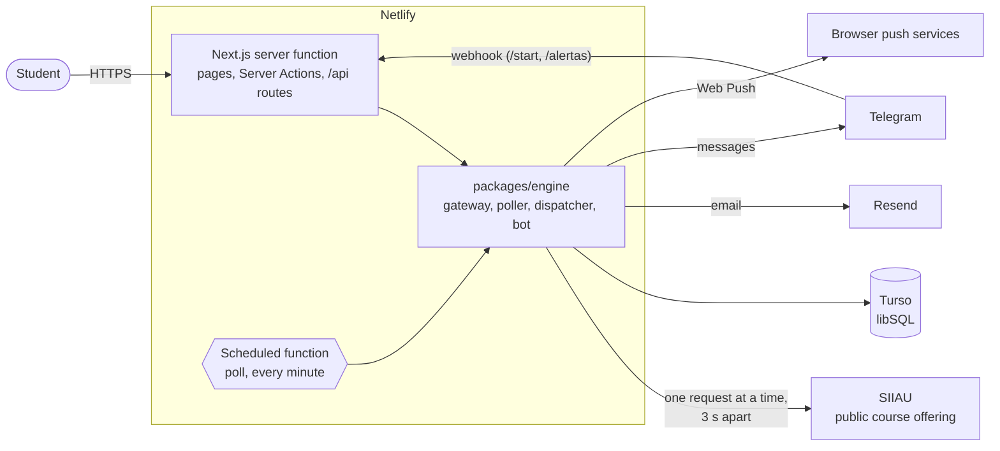

# ¿Hay Cupo?

[](https://github.com/marvin7460/SiiauAlarma/actions/workflows/ci.yml)

Get notified the moment a seat opens up in a University of Guadalajara course section, instead
of reloading SIIAU over and over during registration week.

> Independent student project. **Not affiliated with the University of Guadalajara.**
> [Leer en español](README.es.md).


<sub>Recorded against the fake SIIAU used in the tests (`pnpm --filter @haycupo/web demo:gif`).
Sections and professors are made up.</sub>

## The problem

At the University of Guadalajara (UdeG), students register for classes in SIIAU. Popular
sections fill up in minutes, and seats only come back when someone drops the class. The only
way to catch one is to keep reloading SIIAU's public course-offering page, by hand, for days.
That wastes students' time and puts load on SIIAU.

**¿Hay Cupo?** ("Any seats?") watches the sections you care about and tells you, by email,
Telegram or a browser notification, as soon as one goes from 0 to 1 or more free seats.

## Live app

Launching before the 2027A registration period (January 11–15, 2027).

<!-- TODO(Marvin): replace the line above with the production URL once it is deployed. -->

## Features

- **Search** by cycle, campus and subject (code or name, with autocomplete). Every section shows
  its NRC, capacity, free seats, schedule, building and room, professor, and how fresh the data
  is.
- **Alerts** for a specific NRC, for _any_ section of a subject (optionally filtered by days,
  time window or professor), or for when the offer of a subject is published.
- **Three channels:** email (magic-link sign-in, no passwords), a Telegram bot, and Web Push
  notifications (installable PWA, iPhone included).
- **No false alarms, no spam:** only 0 → >0 transitions count; SIIAU errors or odd pages never
  trigger alerts; one message per alert every 30 minutes at most. Alerts expire on their own
  when registration ends.
- **Public pages:** a [status page](apps/web/src/app/estado/page.tsx) (is it running right
  now?), cookieless [impact metrics](apps/web/src/app/impacto/page.tsx), a privacy notice, and
  self-service "download my data" and "delete my account".

## Stack

| Layer         | Choice                                                                      |
| ------------- | --------------------------------------------------------------------------- |
| App           | One Next.js 16 app (App Router, Server Actions), React 19, Tailwind CSS 4   |
| Background    | A Netlify scheduled function every minute (or an in-process scheduler)      |
| Database      | Turso (libSQL, SQLite in the cloud), Drizzle ORM and migrations             |
| Hosting       | Netlify (free plan); optionally a free VM with Docker for more capacity     |
| Validation    | Zod everywhere data crosses a boundary (SIIAU pages, API, forms, env vars)  |
| Notifications | Resend (email), Telegram Bot API, Web Push (VAPID, RFC 8291) with WebCrypto |
| Tests         | Vitest (unit, integration on a SQLite file and a fake SIIAU), Playwright    |
| Tooling       | pnpm workspaces, ESLint (strict type-checked), Prettier, GitHub Actions     |

Everything runs on free plans.

## Architecture



- **One Next.js app, two entry points on Netlify.** Pages, Server Actions and the Telegram
  webhook run in the server function built by Netlify's Next.js adapter; a scheduled function
  (`apps/web/netlify-functions/poll.ts`) runs the poller every minute. Both use the same
  `packages/engine`. Outside Netlify (local development, a VM), `instrumentation.ts` applies
  migrations and runs the same poller on an in-process timer instead.
- **The gateway is the only way to SIIAU.** Searches and the poller both go through it: one
  User-Agent, one pace and one place to pull the brake.
- **A gateway row in the database** hands out turns (a lease, so only one request is in flight),
  enforces the pause between requests using SQLite's clock, caches `robots.txt`, and holds the
  circuit breaker.
- **Polling is per subject, not per student.** Every minute the poller claims the most
  overdue subject that someone is waiting for (one atomic `UPDATE … RETURNING`), fetches its
  page once, compares free seats with the last poll, and writes notifications to an outbox,
  all in one atomic batch.
- **The dispatcher** sends the outbox by email, Telegram or push, with retries, the daily email
  quota and a cutoff for stale messages ("there is a seat" from an hour ago is useless).
- **Searches are shared:** results are cached for 5 minutes per query, so a hundred students
  looking at the same subject cost one request to SIIAU.

## Responsible use of SIIAU

These rules are not negotiable, and most are enforced in code rather than by convention:

- **Query by subject, not by student:** alerts are grouped by (cycle, campus, subject); one
  request serves all of them.
- **Only subjects with active alerts** are polled. Alerts expire when registration ends.
- **One request at a time, at least 3 seconds apart** (the configuration refuses anything
  under 2 s).
- **Every 5 minutes per subject**, every 2 during registration week, every hour when the offer
  is not published yet. The configuration refuses intervals under 2 minutes.
- **Exponential backoff** per subject on errors, and an **emergency brake**: after 5 errors in
  a row everything pauses (15 minutes, doubling up to 6 hours), plus a manual brake and a kill
  switch.
- **Identifies itself:** the User-Agent carries the project name and a contact email, and
  `robots.txt` is fetched and respected (RFC 9309).
- **Never** registers classes, asks for SIIAU passwords or gets around captchas. Only the
  public course-offering page is used.

## Technical decisions and trade-offs

The full list, with the alternatives considered, is in [docs/decisions.md](docs/decisions.md)
(in Spanish). Highlights:

- **A strict parser over a tolerant one.** SIIAU serves old ISO-8859-1 HTML. The parser
  (htmlparser2 + Zod) throws on anything unexpected; not alerting is better than alerting
  wrongly. It reads weekdays by column position and has its own windows-1252 table, because
  Node's `TextDecoder` treats `windows-1252` as Latin-1.
- **Netlify, within its limits.** Responsible pacing means waiting 3 s between requests, and
  serverless platforms bill that waiting. So each scheduled run polls one subject (it never
  waits for the pause), and searches wait at most 2.5 s for their turn and 5.5 s for SIIAU to
  fit a 10-second page. Even so, the free plan covers about **3 watched subjects**; for more,
  the poller can move to an always-free VM while the site stays on Netlify. Netlify's bundler
  left the monorepo's TypeScript packages as imports that don't exist in production (a local
  test of the packaged function caught it), so the function is pre-bundled with esbuild.
- **A database row as the global lock**, not an in-memory mutex: turns survive restarts and
  would still hold with more than one server.
- **Hand-rolled magic link instead of an auth library**: stores only the email (no IP, no
  User-Agent), hashes every token, and signs in with a button press so mail scanners cannot
  burn the link.
- **An outbox** between detecting a change and delivering it, so a failing email provider never
  loses or repeats an alert.
- **Turso (SQLite) without relying on foreign-key cascades**, since a remote connection does not
  guarantee them: deleting an account deletes every related row explicitly, in one atomic batch.
- **One engine per Next.js bundle.** Next.js bundles pages, API routes and `instrumentation`
  separately; sharing one engine through `globalThis` made errors from one bundle fail
  `instanceof` in another (an outage showed as an internal error). The end-to-end tests caught
  it.
- **Push endpoints are allow-listed** to real browser push services, so a crafted subscription
  cannot turn the server into a proxy.
- **No visitor analytics at all.** Impact metrics are daily aggregate counters; there is no
  cookie banner because there is nothing to consent to.

## Numbers

Measured, not estimated:

| What                                                | Value                                 |
| --------------------------------------------------- | ------------------------------------- |
| Unit and integration tests (Vitest)                 | 260 passing                           |
| End-to-end tests (Playwright, production build)     | 6 passing                             |
| Parse a 30-section page (decode + parse + validate) | 2.3 ms (Node 22, median of 50 runs)   |
| Parse a 100-section page                            | 7.2 ms                                |
| Database tests (fresh SQLite file per test file)    | ~1 s for the schema suite             |
| Requests to SIIAU per subject, regardless of users  | 1 every 5 minutes (2 in registration) |

Usage numbers (seats found, average wait, alerts) are public and live at `/impacto` once the
app is deployed.

<!-- TODO(Marvin): after the 2027A registration week, add the real numbers from /impacto here
(seats found, average time until a seat opened, students, alerts) and one or two sentences on
what they mean. -->

## Run it locally

Requires Node.js 24 (see `.nvmrc`; 22.13+ works) and pnpm 10. No database server and no
accounts: locally the app uses a SQLite file in `data/`.

```sh
pnpm install
cp .env.example .env.local     # fill in APP_SECRET, INTERNAL_API_TOKEN, SIIAU_CONTACT_EMAIL

pnpm --filter @haycupo/fake-siiau start   # fake SIIAU on :8788 (SIIAU_ORIGIN_OVERRIDE points here)
pnpm --filter @haycupo/web dev            # http://127.0.0.1:3000; migrates, then polls every minute
```

With `EMAIL_TRANSPORT=log`, sign-in links and alerts are printed in the terminal. To open a
seat in the fake SIIAU:

```sh
curl -X POST localhost:8788/__fake/available \
  -d '{"cycle":"202620","center":"D","nrc":"78088","available":1}'
```

To use the real SIIAU, leave `SIIAU_ORIGIN_OVERRIDE` empty. Please keep the default pacing.
To check the Netlify build without an account:
`pnpm netlify build --offline --filter @haycupo/web`, then
`pnpm --filter @haycupo/web check:netlify` (loads the packaged scheduled function).

## Tests

```sh
pnpm lint && pnpm typecheck && pnpm test     # what CI runs first
pnpm --filter @haycupo/web test:e2e          # Playwright: builds the site and runs it on a SQLite file
```

- **Parser** tests run against SIIAU-style fixtures (and against real captured pages once they
  are added with `pnpm capture`).
- **Change detection, anti-spam, schedule and filters** are pure functions in `packages/core`.
- **Gateway** tests cover pacing, the lease, the breaker, robots.txt and the kill switch against
  a real SQLite database (a temporary file, the same engine as Turso).
- **The poll cycle integration test** runs the whole pipeline against the fake SIIAU: a seat
  going from 0 to 1 sends exactly one email (and one Telegram message and one push when those
  channels are on), and nothing is sent when SIIAU fails or changes its HTML.
- **End to end:** search → sign in by magic link → create alert → seat opens → exactly one email
  captured; the same through Telegram (linking via the webhook, message captured by a fake Bot
  API); data export and account deletion; public pages without cookies.

## Deploy

Step by step, all on free plans: [docs/deploy.md](docs/deploy.md) (Spanish): Turso, Resend
and a Netlify site created with the Netlify CLI. Telegram bot setup:
[docs/telegram.md](docs/telegram.md). Each production deploy costs Netlify credits, so the
`Deploy` workflow runs by hand or on a `v*` tag, never on every push: it checks the code,
applies migrations to Turso and deploys with `netlify deploy --prod`, which builds first. CI
builds the Netlify bundle and loads the packaged scheduled function on every push.

## Project layout

| Path                                          | What it is                                                             |
| --------------------------------------------- | ---------------------------------------------------------------------- |
| `apps/web`                                    | The Next.js app: pages, API routes, startup (migrations, scheduler)    |
| `apps/web/netlify.toml`, `netlify-functions/` | Netlify build settings and the scheduled poll function                 |
| `packages/engine`                             | Gateway to SIIAU, search, poller, dispatcher, Telegram bot, retention  |
| `packages/siiau`                              | SIIAU client and parser (runtime-agnostic), with fixtures              |
| `packages/core`                               | Pure rules: change detection, filters, anti-spam, schedule, expiry     |
| `packages/db`                                 | Drizzle schema for Turso/SQLite, migrations, test database helpers     |
| `packages/notify`                             | Email, Telegram and Web Push channels, message templates, signed links |
| `tools/fake-siiau`                            | Fake SIIAU (and fake Telegram Bot API) for tests and local development |
| `Dockerfile`, `compose.yaml`, `deploy/`       | Optional VM: the poller (or the whole app + Caddy) with Docker         |
| `docs/`                                       | SIIAU analysis, decisions, deploy and Telegram guides (in Spanish)     |

## How I used AI

This project was built with [Claude Code](https://claude.com/claude-code), Anthropic's coding
agent, working from a written brief: the problem, the requirements, the non-negotiable rules
for using SIIAU responsibly, and my own analysis of how SIIAU's course offering works
([docs/siiau.md](docs/siiau.md)).

- **How we worked:** five phases (parser → search → email alerts → Telegram and push → launch
  pages and docs). Each phase ended with lint, type checks and tests passing, a commit, and a
  list of things to test by hand. Every important decision was written down with its
  trade-offs in [docs/decisions.md](docs/decisions.md), including the places where the
  plan changed: a database lease instead of a Durable Object, a hand-rolled magic link instead
  of an auth library, and later a move from Postgres + Cloudflare + Vercel to Turso and a
  single Next.js app on Netlify, sized after measuring what Netlify's free plan can afford with
  the 3-second pacing.
- **What the AI did:** most of the code, tests and documentation, plus catching problems along
  the way (Node's windows-1252 decoding bug, Turso not guaranteeing cascades, push endpoints
  as a proxy, error classes duplicated across Next.js bundles).
- **What it could not do, and I did or still have to do:** check the parser against real SIIAU
  pages (the development sandbox could not reach SIIAU), deploy and verify on the real Netlify
  site, and decide product questions. A few small, self-contained pieces were left on purpose
  for me to write by hand, each marked `TODO(Marvin)` with hints and skipped tests that define
  "done".
- **Guardrails:** tests before trusting anything (a fake SIIAU, a real SQLite database,
  end-to-end runs against the production build, the packaged Netlify functions run locally),
  CI on every push, no secrets in the repository.

<!-- TODO(Marvin): add a few sentences in your own words: what you reviewed or changed, what you
learned, and what you would do differently. That is the part a reader cares about most. -->
